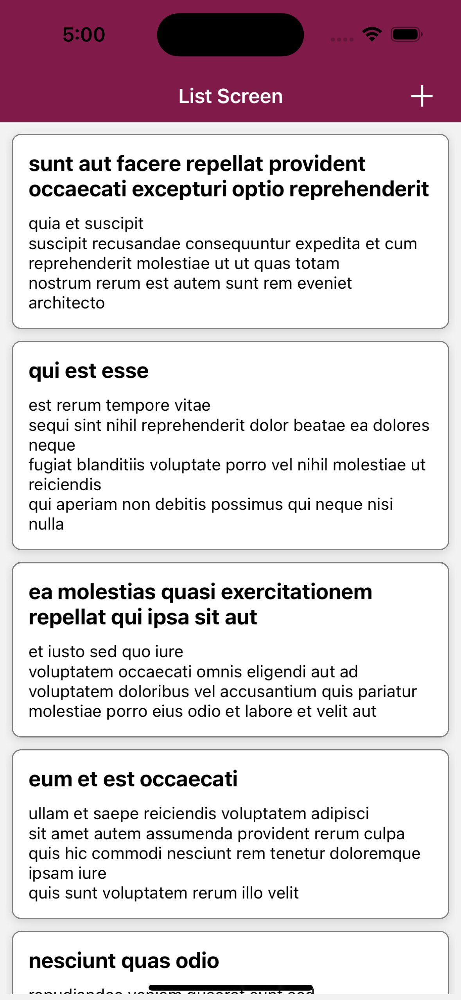

# React Native Task

## How To Install
1. before you start make sure to run `yarn install` or `npm install`.
2. make sure you have installed expo, if its not, please follow the [Expo Docs](https://docs.expo.dev/get-started/installation/).
3. run `expo start --android` for Android and `expo start --ios` for ios.
4. incase you want to use the app on your physical device:
   * download EXPO app from GooglePlay or AppStore
   * run `expo start`
   * scan the QR code that appears in the terminal and it directly open the app through EXPO App.

## Description
The app have mainly the following features:
1. show the items list from the server `https://jsonplaceholder.typicode.com/posts`.
2. update item list.
3. add item into list

## Screenshots
### 1. List Screen

### 2. Form Screen [Update Item]

### 3. Form Screen [Add new Item]

